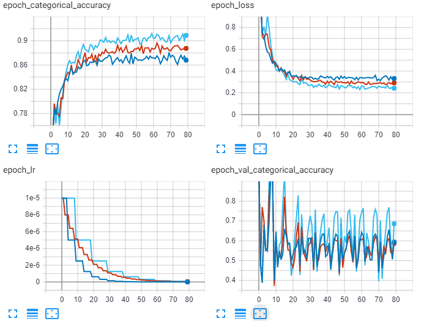
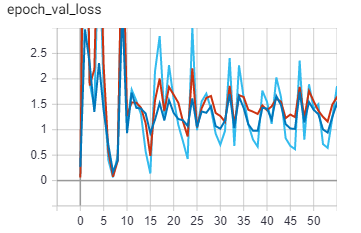
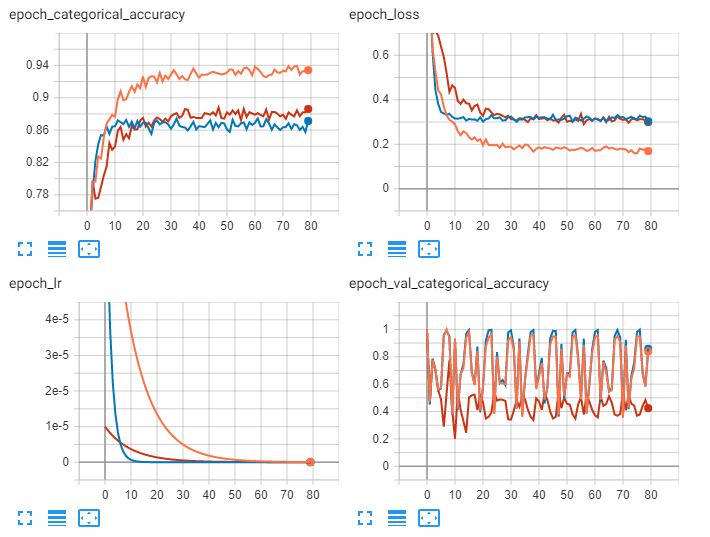
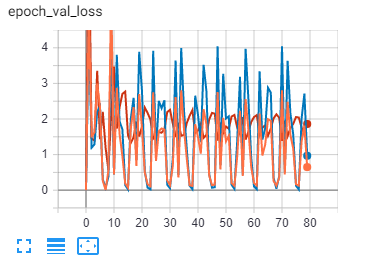
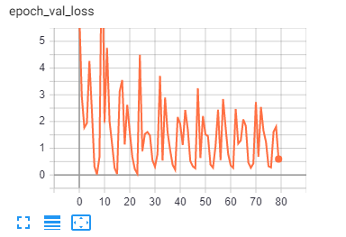
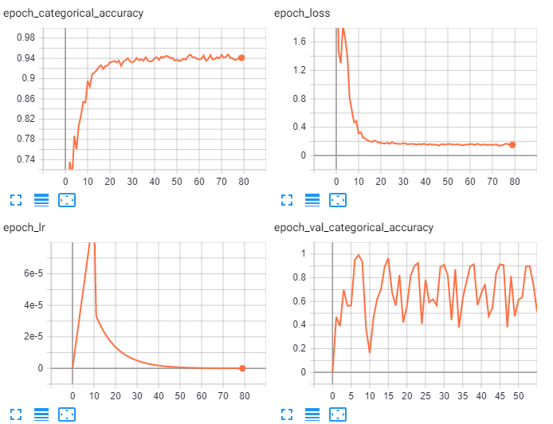
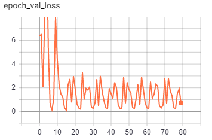

# Lab5
### Пошаговое затухание (Step-Decay)
 * Синий   
- [x] initial_lrate=0.00001
- [x] drop=0.5
- [x] epoch_drop=5
* Красный 
- [x] initial_lrate=0.00001
- [x] drop=0.8
- [x] epoch_drop=5
* Голубой 
- [x] initial_lrate=0.00001
- [x] drop=0.5
- [x] epoch_drop=10

Голубой график сходиться быстрее всех ,но имеет большой разброс на валидационной ошибке. Точность и ошибка на валидационной выборке у красного и синего графиков примерно одинакова но красныйсходиться быстрее. 
Оптимальныйми являються параметры соответствующие красному графику. 

### Экспоненциальное затухание (Exponential Decay)
* Оранжевый
- [x] initial_lrate=0.0001
- [x] k=0.1

* Синий
- [x] initial_lrate=0.0001
- [x] k=0.5
* Красный
- [x] initial_lrate=0.00001
- [x] k=0.5

### Политика “предварительного разогрева” (Warm-Up)
 1)Пошаговое затухание  
- [x] initial_lrate=0.0001
- [x] drop=0.5
- [x] epoch_drop=5

2) Экспоненциальное затухание
- [x] initial_lrate=0.0001
- [x] k=0.5

