# Lab 4

#### Выбор  максимально возможного темпа обучения
* Оранжевый - lr=0.01
* Синий - lr=0.001
* Красный - lr=0.0001
* Розовый -  lr=0.00001
* Серый -  lr=0.000001
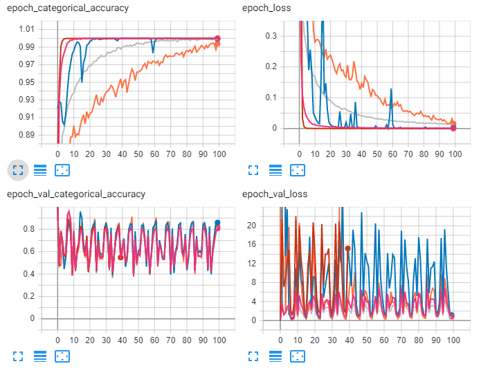

#### Горизонтальное отражение
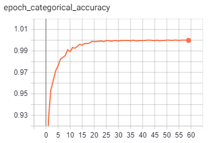
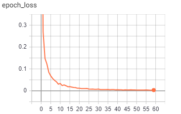
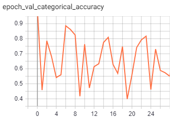
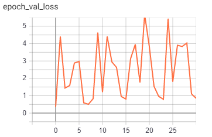

#### Поворот на случайный угол
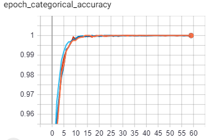
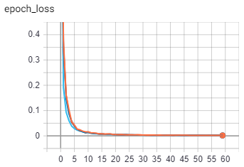
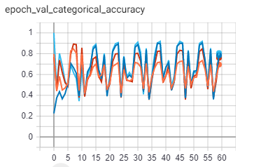
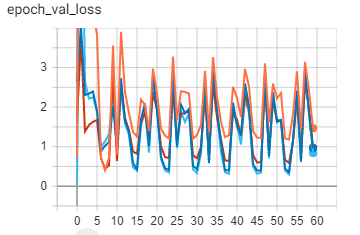

#### Изменение яркости и контраста
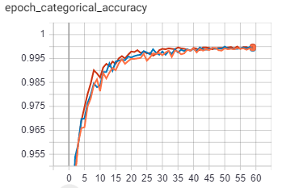
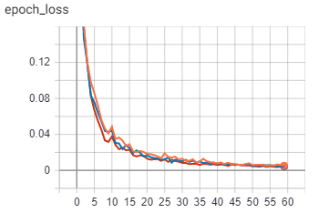
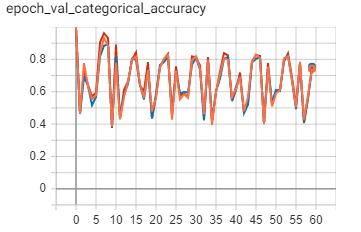
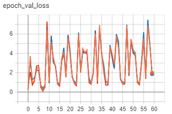

