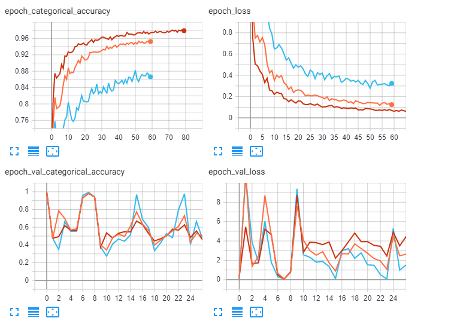

# Lab 4

#### Выбор  максимально возможного темпа обучения

* Оранжевый - lr=0.01
* Синий - lr=0.001
* Красный - lr=0.0001
* Розовый -  lr=0.00001
* Серый -  lr=0.000001

#### Горизонтальное отражение

#### Поворот на случайный угол
Оранжевый - 15 
синий - 30
Красный - 45
Голубой - 90

#### Изменение яркости и контраста
*Оранжевый
tf.image.random_brightness(image, 0.6, seed=None)
image = tf.image.random_contrast(image, lower=0.3, upper=1.3, seed=None)    

*синий
tf.image.random_brightness(image, 0.4, seed=None)
    image = tf.image.random_contrast(image, lower=0.3, upper=1.3, seed=None)    

*красный
tf.image.random_brightness(image, 0.4, seed=None)
    image = tf.image.random_contrast(image, lower=0.5, upper=1.5, seed=None)   
    

#### Использование случайного участка изображения

Оранжеый - размер участка 100 х 100
Красный - размер участка 150 х 150
Голубой - размер участка 50 х 50 

