# Lab 3

Обучение нейронных сетей с использованием техники Transfer Learning

# 2b 
Cеть с lr=0.0001 на обучающей выборке сходится быстрее всех.
На обучающей выборке  эксперименты с темпом обучения 0.001 и 0.0001 ведут  себя практически одинаково. Разброс по точности у всех на валидационной выборке практически одинаковый.

* lr=0.01 - оранжевый
* lr=0.001 - синий
* lr=0.0001 - красный

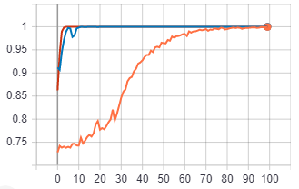
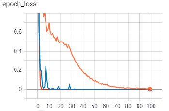
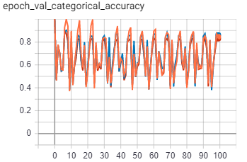
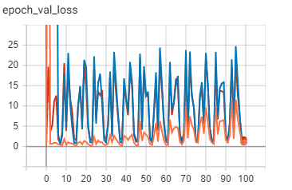

Оптимальный вариант - lr=0.0001

# 3с
* lr=0.01 - оранжевый
* lr=0.001 - синий
* lr=0.0001 - красный

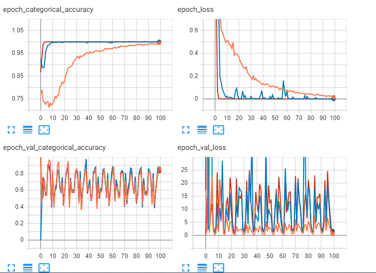

# 3d
* lr=0.01 - Cиний
* lr=0.001 - Красный
* lr=0.0001 - Голубой

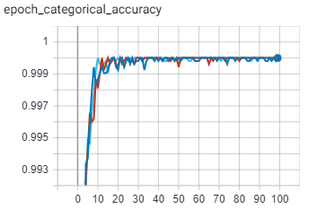
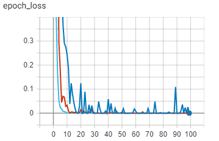
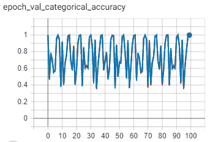
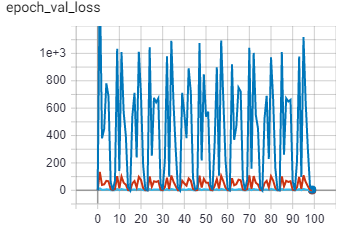

Голубой график сходится быстрее всех и обладает наименьшей ошибкой на валидационной выборке. В связи с этим оптимальный  lr=0.0001
# 3e
* lr=0.01 - оранжевый
* lr=0.001 - синий
* lr=0.0001 - красный

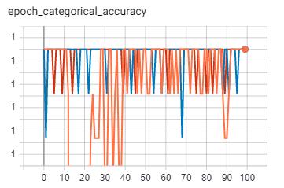
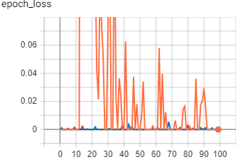
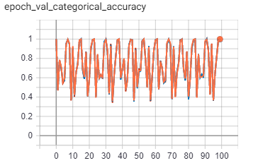
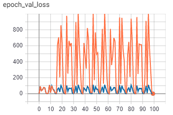

Синий и красный графики ведут себя практически одинаково.
