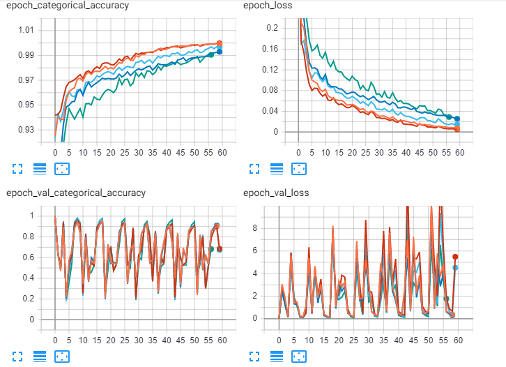

# Lab 2

* Оранжевый - 2 Conv2D с размером ядра свётки 3
* Синий - 3 Conv2D с размером ядра свётки 3
* Красный - 3 Conv2D с размерами ядра свётки 3,4,5
* Голубой -  4 Conv2D с размерами ядра свётки 3,3,4,5
* Зеленый - 6 Conv2D с размерами ядра свётки 5,5,4,4,3,3

### Графики
Точность на тестовой выборке
 
